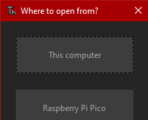
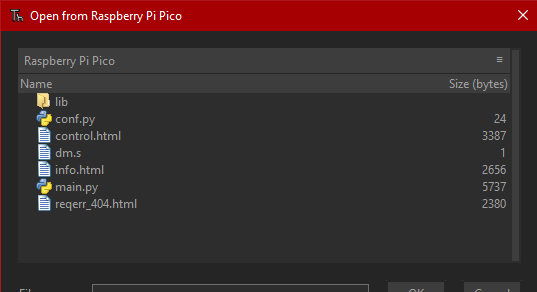
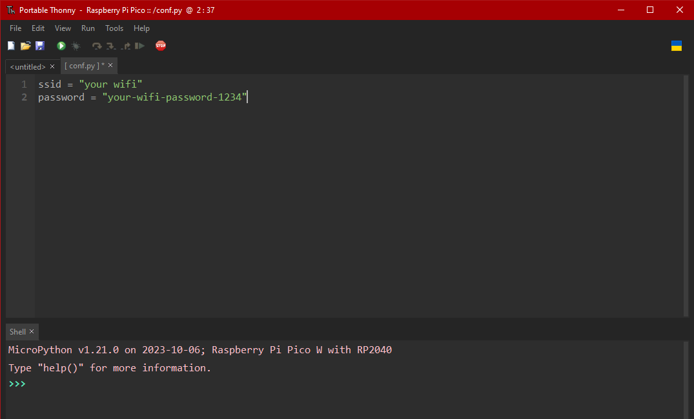

# How to connect to a PicoBot
## Requirements
- A PicoBot
- A Computer with Thonny IDE installed

## 1. Configuration
To get started, you must configure the PicoBot to let it connect to your WiFi.
1. Open up Thonny IDE and connect the PicoBot, then click on the bottom right and click "MicroPython (Raspberry Pi Pico)" from the list that appears.
2. Click File > Open... and select "Raspberry Pi Pico".
3. Double click on the file named "conf.py".
4. Write in the backticks after "ssid" the name of your WiFi (Warning: it's case sensitive)
5. Write in the backticks after "password" the password of your WiFi (Warning: this is case sensitive too)
6. Click File > Save and close Thonny IDE.
## 2. Connection
Turn the PicoBot on, then follow the guide that's displayed on it's screen.